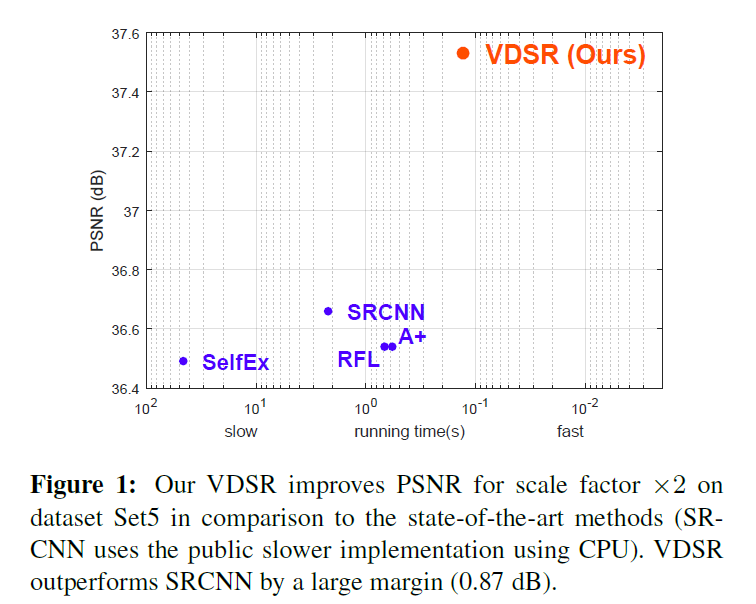
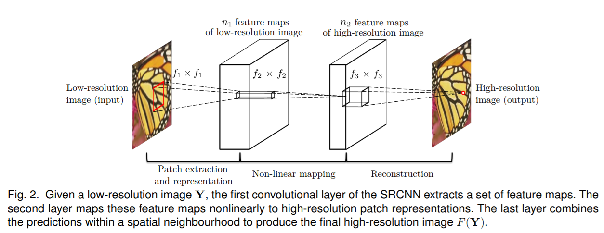
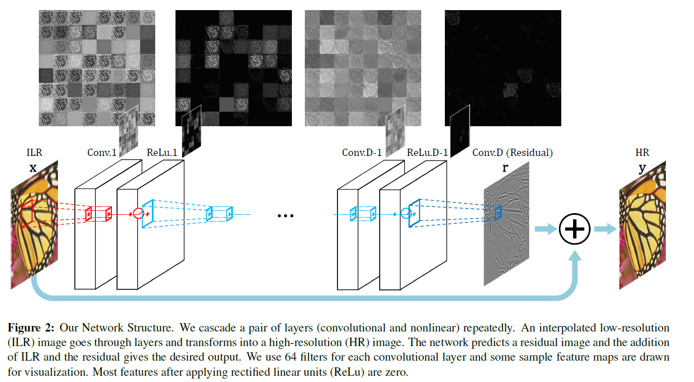
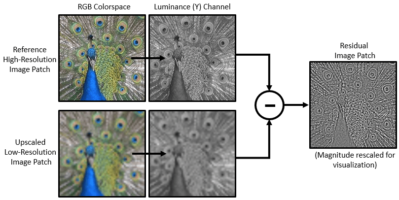
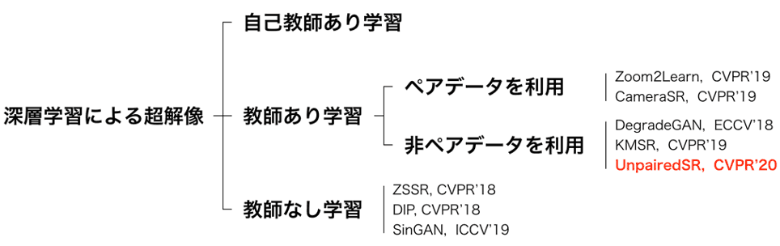
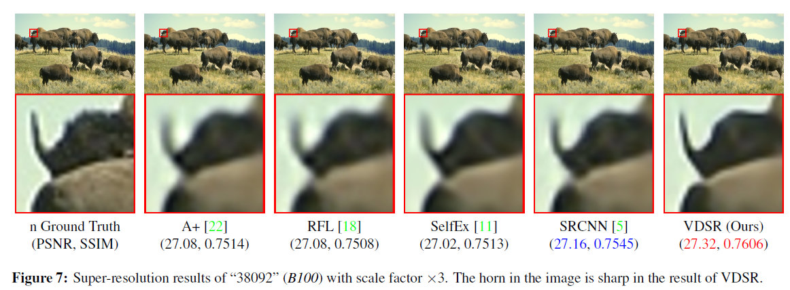
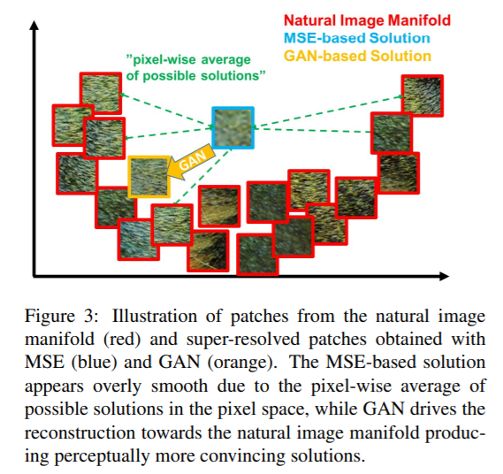

# 単眼超解像(Single Image Super Resolution)手法のVDSR (Kim et al., 2016, CVPR) について勉強＆動かしてみた
# はじめに

この記事は、MATLAB/Simulink Advent Calendar 2021（カレンダー2）の22日目の記事として書かれています。

[https://qiita.com/advent-calendar/2021/matlab](https://qiita.com/advent-calendar/2021/matlab)

間違いなどがあれば、教えていただけますと幸いです。 こちらの記事で用いたコードはこちらにアップロードしています。勉強会やまとめ資料用、ゼミ活動など、何かの役に立てば嬉しいです。

ここでは、低解像度の画像を高解像化する手法について勉強したため、そのまとめとして紹介します。詳細は[もとの論文である、Kim et al (2016) ](https://openaccess.thecvf.com/content_cvpr_2016/html/Kim_Accurate_Image_Super-Resolution_CVPR_2016_paper.html)[1]をご覧ください。以下の図は、そのイメージです。低解像度の画像を nearest neighborにより拡大したものと、今回紹介する手法によって高解像度化したものを重ねています。（深層学習を使わず、バイキュービック補間で拡大した場合でも、ある程度よい結果が得られます。）まだまだ勉強中で、誤った点や不十分な記述があるかもしれません。その場合は教えていただけますと幸いです。

単眼超解像のイメージ。VDSRとよばれる方法を用いて高解像度化した画像と、画像サイズの小さい画像を、nearest neighborによって拡大したものを重ね合わせている。評価の際はバイキュービック補間で拡大したものとの比較を行う。

  
# 単眼超解像の手法について

単眼超解像に関する先行研究に関しては、以下の記事などが非常に参考になりました。こちらの記事では、VDSRのみ取り扱うため、他の手法との比較については、他の記事を参考にいただけると幸いです。

**トップ学会採択論文にみる、超解像ディープラーニング技術のまとめ**

[https://qiita.com/jiny2001/items/e2175b52013bf655d617](https://qiita.com/jiny2001/items/e2175b52013bf655d617)

**Deep Learningによる超解像の進歩**

[https://www.slideshare.net/HHiroto/deep-learning-106529202](https://www.slideshare.net/HHiroto/deep-learning-106529202)

**コンピュータビジョンの最新論文調査 Single Image Super-Resolution 前編**

https://engineer.dena.com/posts/2019.09/cv-papers-19-single-image-super-resolution-1/

# イントロダクションの和訳

本論文の位置づけや新規性を理解すべく、以下に、**私の勝手な解釈に基づいた**論文のイントロダクションの和訳を掲載します。意訳なども含むのでご注意ください。

========================================================

本研究では、単眼超解像（Single Image Super Resolution: SISR）と呼ばれる、低解像度(Low Resolution: LR) 画像から、高解像度画像を生成する問題について扱う。単眼超解像（SISR）は、コンピュータビジョンにおいて広く利用されており、その場の要求に応じて高解像度な画像が必要になるセキュリティや監視、さらに医療画像解析など多岐にわたる。そのため、単眼超解像はコンピュータービジョンの界隈で広く研究されてきた。黎明期から使われてきた手法には、バイキュービック補間などの補間手法や、ランチョス・リサンプリング[7]などの統計的に割り出された画像の前提条件 [20, 13]/internal patch recuurence [9]を利用したより強力な手法などがある。

　現在、低解像度なパッチから高解像度なパッチへのマッピングをモデル化するために、学習法が広く用いられている（筆者追記：パッチとは、画像を切り出した小さな画像やその集まりのこと）。Neighbor embedding [4,15]はパッチ部分空間を補間する方法である．スパースコーディング法[25, 26, 21, 22]は、スパースな信号表現に基づくコンパクトな辞書を学習する方法である。最近では，ランダムフォレスト[18]や畳み込みニューラルネットワーク(CNN)[6]も用いられ，精度が大きく向上している。

　その中で、Dongら[6]は、CNNを用いて低解像度画像から高解像度画像への変換をエンドツーエンドで学習できることを示した。SRCNNと呼ばれる彼らの手法は、他の手法で一般的に必要とされる（手動で）定義された画像の特徴を必要とせず[25, 26, 21, 22]、最先端の性能を発揮するものである。確かに、SRCNNは超解像（SR）問題に深層学習技術を導入することに成功したが、3つの側面において、いまだ改善の余地がある。第一に、小さな画像領域のコンテキストに依存している、第二に、学習の収束が遅すぎる、第三に、ネットワークは単一のスケールに対してのみ機能する、ということである。本研究では、これらの問題を実用的に解決するための新しい手法を提案する。

**コンテクスト **

　非常に大きな画像領域にわたる文脈情報（筆者追記：非常に小さな領域を見るのではなくて、少し周りの連続性とか、こういうパターンになってるとか、そういう"文脈"を捉えますよ、という意味に近い？）を我々の手法では利用する。スケールファクターが大きい場合（筆者追記：例えば、非常に小さな画像を、もっと大きな解像度のものに変換しようとすること）、小さなパッチ（ここでは、画像を小さく切り出したもの）に含まれる情報だけでは画像の詳細の復元には不十分である場合が多い（不良設定問題：ill-posed）。一方、本研究で提案する手法は、大受容野を用いた、深いネットワークであり、より広域な画像のコンテキストを考慮したものとなる（受容野については以下の図を参照ください。ここでは、畳み込みのときに見られる側のエリア、くらいの意味でもよいかもしれません）。

\href{https://stanford.edu/~shervine/teaching/cs-230/illustrations/receptive-field-a.png?3f718275d9c2de56f2255b2a4797ea87}{\underline{https://stanford.edu/\textasciitilde{}shervine/teaching/cs-230/illustrations/receptive-field-a.png?3f718275d9c2de56f2255b2a4797ea87}}

引用：アフシンアミディ・シェルビンアミディ 著　畳み込みニューラルネットワーク チートシート

  

**学習の収束について**

学習を高速化させる方法として、残差学習型CNN（筆者追記：ここでは、差分を学習する、という意味合い）および、非常に高い学習率を用いた手法を提案する。低解像度画像と高解像度画像は多くの場合、同じ情報を共有（筆者追記：例えば、解像度は違っても同じエリアには、猫の耳っぽい似た輝度値のピクセルがたくさんある）しているため、高解像度画像と低解像度画像の差分を明示的にモデル化し学習させるすることが効果的である。そのため、筆者らは、入出力の画像が似ている場合に効率よく学習できるネットワーク構造を提案する。さらに、我々の初期学習率はSRCNN[6]の104倍である。これは、残差学習と勾配クリッピングによって可能となる。

**スケールファクター **

　我々は１つのモデルのみによる（筆者追記：アンサンブルではない、という意味合い？）、単眼超解像の手法を提案する。高解像度化するときの倍率は、通常、ユーザが指定し、端数も含めて任意に設定できるべきである。例えば、画像ビューアでのスムーズなズームインや、特定の大きさへのリサイズができるとよい（筆者追記：例えば、何らかのアプリを使って、ユーザーが好きな倍率でズームインをして、その時々でキレイに高解像度化されたものがみれるといいよね、みたいな感じだと思います）。全ての起こりうるパターンに備え、多くのスケール依存のモデルを学習・保存することは非現実的である（筆者追記：ユーザーが1.5, 2, 3, 4, 5, ... 倍にズームする可能性があるので、それぞれ専用のネットワークを用意するのは現実的ではないよね、という意味）。そのため、複数の倍率にも対応できる、畳み込みネットワークによる単眼超解像の手法を考案した。

**貢献**

　要約すると、本研究では、非常に深い畳み込みネットワークに基づく高精度な単眼超解像の手法を提案する。非常に深いネットワークは、小さな学習率を用いると収束が遅くなりすぎる問題がある。一方、高い学習率で収束率を高めると勾配爆発が起こり、うまく学習できなくなるため、残差学習と勾配クリッピングでこの問題を解決する。さらに、一つのネットワークでマルチスケールの超解像の問題に対応可能な方法を示す。図1にあるように、本手法は最先端の手法と比較しても、比較的高精度かつ高速であることがわかる。

========================================================

# イントロダクション補足

イントロダクションでは、Dong ら(2015)のSRCNNとよばれる手法について述べられていました。以下の図のような非常にシンプルで浅いネットワークで超解像化を行った論文です。2021年12月現在では5000以上の引用がされていてすごいです。その3層のものに比べて、20層の「非常に層の深い」モデルを本論文では提案しています。現在は、20層で深いネットワークと表現することは少ないですが、いろいろとCNNに改良が重ねられて現在のもっと深いネットワークがあるのだなあと感じました。Dongらの論文でも、より深いネットワークも試されましたが、それはうまくいかなかった、と論文中に記述があります。

> The effectiveness of deeper structures for super resolution is found not as apparent as that shown in image classification [17]. Furthermore, we find that deeper networks do not always result in better performance.

図出典：Dong et al., (2015) [2] より

  
# ここで紹介する手法（VDSR）の流れについて

以下に、Kimらの方法の流れの図を示します。入力の画像があって、畳み込み演算などをするとともに、下側に分岐があって、グレーの画像と＋されていることがわかります。まずはこれについて述べます。

図出典：Kimら (2016) [1] より

# 残差の学習について

このネットワークでは、直接的に高解像度化された画像を推論するのではなく、イントロダクションにあったように、その差分を学習します。つまり

（学習するもの）＝（高解像度な訓練用の正解データ）- （それに対応する低解像度の画像をバイキュービック補間により拡大したもの）

になります。下の図にもマイナス（ー）のマークがありますが、それが差分を取っていることを示します。ここで得た差分を"Residual"と表現されています。

  

図出典：MATLABドキュメンテーションより

## 入出力について

入力：低解像度をバイキュービック補間により拡大したもの

出力：入力の各ピクセルに対する、高解像度画像との差分

になっていて、その出力に入力の画像の値を足し合わせると、高解像度な画像になるように設計されています。前述したプラス（＋）のマークに相当します。

また、ここでは、RGBではなく、RGB の色の値を YCbCr 色空間に変換し、その輝度のチャンネルのみを用いています。

人間の目は、色よりも明るさに敏感だからだそうです

> This is because human vision is more sensitive to details in intensity than in color.

https://www.wdic.org/w/WDIC/YCbCr

  
## 入力のサイズについて

ここでは、画像全体を入力するのではなく、画像を小さな領域に区切って（パッチ）、それを入出力としています。例えば画像から、41×41ピクセルのパッチを複数きりだし、それらを学習させます。

  
## マルチスケールについて

イントロダクションにもあったように、特定の倍率、例えば２倍にしかできません、だと実用性がさがるため、学習の際は、複数の倍率で高解像度な画像を縮小させ、学習させています。

  
# 手法の分類について

このように、今回の超解像の手法では、高解像度な画像があれば、ラベリングも必要なく学習ができるため、自己教師あり学習と分類することもできます。ただ、いろいろと考え方はあると思うので、ひとまず本稿ではそうする、というニュアンスでお願いします。

以下の図のように単眼超解像の手法も分類できるそうで、今回は自己教師あり学習ですが、他にも方法は多く存在します。

**画像出典：AI-SCHOLAR「ペア画像はいらない！実用的な超解像技術の提案」（**[**Navier（ナビエ）株式会社**](https://www.navier.co/)** 様による解説記事）**

  

参考情報：非常に勉強になる記事でした。ありがとうございました。

https://ai-scholar.tech/articles/%E4%BC%81%E6%A5%ADai%E8%AB%96%E6%96%87/navier_paper

# 結果の例

以下に、VDSRによる結果の例を論文から引用します。一番右の結果がVDSRによるもので、確かに角の先も含め鮮明に高解像度化できていることがわかります。

**図出典：Kimら (2016) [1] より**

  

評価指標を用いての定量評価については割愛します。評価については、以下の論文が非常に勉強になりました。

川嶋先生、中村先生「深層学習を用いた衛星画像の超解像手法」

https://www.jstage.jst.go.jp/article/rssj/38/2/38_131/_pdf/-char/ja

  
# GANとの違いは？

上の手法の分類図でも、GAN（敵対的生成ネットワーク）による方法も多く提案されていました。今回のように、画像から画像を推論（image-to-image）をする手法と比べ、Generator（生成ネットワーク）とDiscriminator（識別ネットワーク）にて競うように学習させていく方式とどのような違いがあるのでしょうか。

　例えば以下はLedig et al., (2017)より [3] 引用した図ですが、MSE（Mean Squared Error: 平均二乗誤差）をもとに最適化していくと、ピクセル単位での評価の総和になるため、各ピクセルが「ありそうな」ピクセル値の平均的なところに収束してしまい、全体として、滑らかな画像になってしまう、という旨の記述がありました。これは、赤枠で示されてるように、単眼超解像によって生成すべきものが一意に定まらないことが原因です。

**画像出典：Ledig et al., (2017)より [3] **

  

また、同様の議論は、VAE（変分オートエンコーダ―）とGANの比較でもあります。例えば、以下の文章は、巣籠先生著「詳説ディープラーニング」[4] からの引用です。

> （VAEの）**誤差関数には2乗誤差あるいは交差エントロピー誤差の項が用いられることになりますが、これを最小化しようとすると、全体的に画素を曖昧にさせた方が画像全体としての誤差は小さくなります。そのため、VAEではどうしても生成画像がぼやける傾向が出てきてしまうのです。**

VAEでも画像を生成することはできますが、ここでも全体的に画像が滑らかな感じになりがちで、キレイなエッジなどが生成しにくい、という事だと思います。

　

# 実際にVDSRを動かしてみよう

こちらのMATLABの公式ドキュメントを参考に動かしてみました。おそらく多くの場合、下のURLの中のcopy commandでコマンドをコピーし、MATLAB上でペーストすれば該当のコードが開き、RUNボタンを押せばうまく動くと思います。

https://jp.mathworks.com/help/images/single-image-super-resolution-using-deep-learning.html

しかし、2ギガバイト弱のデータなどをダウンロードすることがデフォルトになっており、ダウンロードに少し時間がかかってしまいます。

今回は、ネットワークの構造をanalyzeNetworkで可視化したり、テストが画像の推論に絞ったものを以下のページにアップロードしています。なお、コードの内容はほとんどもとのドキュメンテーションの内容と同一です。

  
# まとめ

   -  シンプルな方法で精度よく高解像度化ができる論文で非常に勉強になりました。 
   -  今回は、imresize関数を用いて縮小しているため、実際に低解像度な撮り方をしたものではありません。実際に解像度の違う画像ペアでも学習/テストしてみたいと思いました。 
   -  この記事では、Very Deep Super Resolution (VDSR)とよばれる、画像から画像を推論する単眼超解像の手法について述べてきましたが、GANを用いた方法も近年は多く発表されており、今後はそちらの勉強もしていきたいと思いました。 

# その他：参考にさせていただいたネットの記事

勾配クリッピングについて

[https://masamunetogetoge.com/gradient-vanish](https://masamunetogetoge.com/gradient-vanish)

不良設定問題について

[https://imidas.jp/genre/detail/K-102-0105.html](https://imidas.jp/genre/detail/K-102-0105.html)

  
# 参考文献

[1] [Kim, J., Lee, J.K. and Lee, K.M., 2016. Accurate image super-resolution using very deep convolutional networks. In Proceedings of the IEEE conference on computer vision and pattern recognition (pp. 1646-1654).](https://openaccess.thecvf.com/content_cvpr_2016/html/Kim_Accurate_Image_Super-Resolution_CVPR_2016_paper.html)

[2] Dong, C., Loy, C.C., He, K. and Tang, X., 2015. Image super-resolution using deep convolutional networks. *IEEE transactions on pattern analysis and machine intelligence*, *38*(2), pp.295-307.

[3] [Ledig, C., Theis, L., Huszár, F., Caballero, J., Cunningham, A., Acosta, A., Aitken, A., Tejani, A., Totz, J., Wang, Z. and Shi, W., 2017. Photo-realistic single image super-resolution using a generative adversarial network. In Proceedings of the IEEE conference on computer vision and pattern recognition (pp. 4681-4690).](https://openaccess.thecvf.com/content_cvpr_2017/html/Ledig_Photo-Realistic_Single_Image_CVPR_2017_paper.html)

[4] 巣籠 悠輔：[詳説ディープラーニング　■生成モデル編](https://www.amazon.co.jp/%E8%A9%B3%E8%AA%AC%E3%83%87%E3%82%A3%E3%83%BC%E3%83%97%E3%83%A9%E3%83%BC%E3%83%8B%E3%83%B3%E3%82%B0-%E7%94%9F%E6%88%90%E3%83%A2%E3%83%87%E3%83%AB%E7%B7%A8-%E5%B7%A3%E7%B1%A0-%E6%82%A0%E8%BC%94-ebook/dp/B07QYFJP37)
